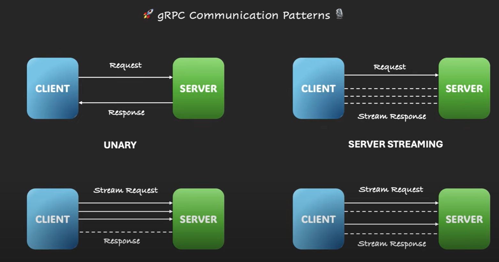

# Spring Boot and Grpc

[Tutorial](https://www.youtube.com/playlist?list=PLVz2XdJiJQxw0f6wXQCdWKabLdqSzGA0X)

## Introduction

While rest only supports Request-Response *UNARY* communication patterns, grpc supports many communication patterns:

 - UNARY
 - SERVER STREAMING
 - CLIENT STREAMING
 - BIDIRECTIONAL STREAMING

## Server

### Unary

In case of unary is more or less like a REST server, except you have the proto folder and you have to run

    ./mvnw clean install 

To generate the `target/generate-sources/protobuf` source folder. Then it behaves like a *contract-first* approach.

You create a class named for example `StockTradingServiceImpl` which extends the class generated by protobuf `StockTradingServiceGrpc.StockTradingServiceImplBase` and 
override/implement the methods you want to override

### Server Streaming

Why in this case would need a stream? Because the stock price change every second, so it could be useful that the client open a connection and
the server continue sending it updates one every second for example.

So how to do it? First we have to tell the .proto file about we want to have a streaming rpc connection
Then in this case to simulate a server business logic we will make the thread sleep for 1 second

## Client

Spring boot right now does not have a client for grpc so we have to remove these two dependencies

    <dependency>
        <groupId>org.springframework.grpc</groupId>
        <artifactId>spring-grpc-spring-boot-starter</artifactId>
    </dependency>

    <dependency>
        <groupId>org.springframework.grpc</groupId>
        <artifactId>spring-grpc-test</artifactId>
        <scope>test</scope>
    </dependency>

And add a grpc client dependency

        <dependency>
			<groupId>net.devh</groupId>
			<artifactId>grpc-client-spring-boot-starter</artifactId>
			<version>3.1.0.RELEASE</version>
		</dependency>

Then in `StockTradingServiceGrpc` you can find a lot of method you can use to *stub* your requests. Some of that are used for
unary operations and some others for streaming operations.

*When you implement the java class, since it's not a grpc server application you muss not use the @GrpcService annotation*

    @Service
    public class StockClientService {
    }

### Unary

When you define a stub in the client you have to give it a name, in our case `stockService`

    @GrpcClient("stockService")
    private StockTradingServiceGrpc.StockTradingServiceBlockingStub serviceBlockingStub;

Then in the `application.yml` you define the following structure to be sure that the client is connected to the right service

    grpc:
        client:
            stockService:
                address: "static://localhost:9090"
                negotiation-type: PLAINTEXT

As you can see the `stockService` named is defined here to configure the address and the negotiation-type

### Server Streaming

Since it's a service streaming we cannot use a *blocking* stub. We can use a normal stub, something like the following

    @GrpcClient("stockService")
    private StockTradingServiceGrpc.StockTradingServiceStub serviceStub;

This is a stub to allow clients to do async tpc calls to service