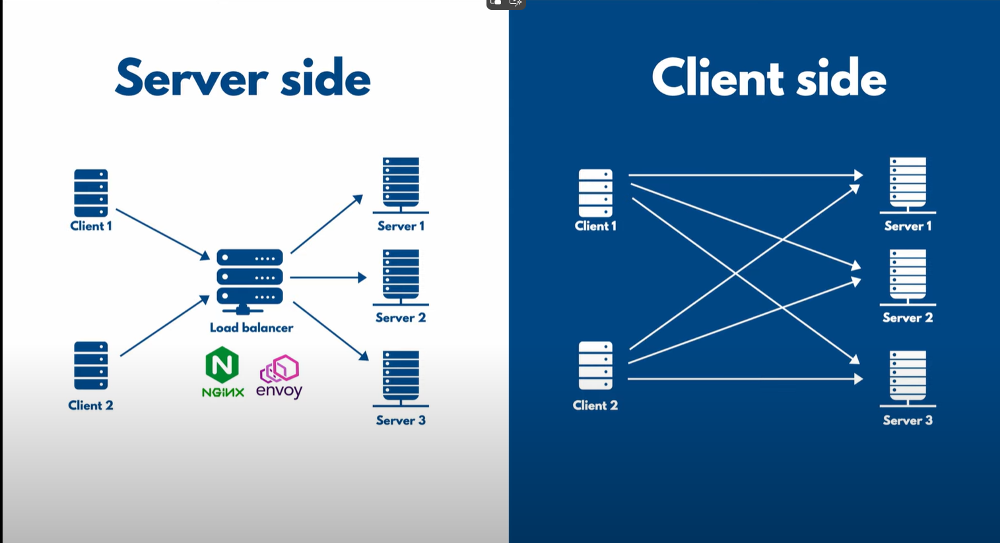

# Spring Boot and Grpc

[Tutorial](https://www.youtube.com/playlist?list=PLVz2XdJiJQxw0f6wXQCdWKabLdqSzGA0X)

## Introduction

While rest only supports Request-Response *UNARY* communication patterns, grpc supports many communication patterns:

 - UNARY
 - SERVER STREAMING
 - CLIENT STREAMING
 - BIDIRECTIONAL STREAMING

## Server

### Unary

In case of unary is more or less like a REST server, except you have the proto folder and you have to run

    ./mvnw clean install 

To generate the `target/generate-sources/protobuf` source folder. Then it behaves like a *contract-first* approach.

You create a class named for example `StockTradingServiceImpl` which extends the class generated by protobuf `StockTradingServiceGrpc.StockTradingServiceImplBase` and 
override/implement the methods you want to override

### Server Streaming

Why in this case would need a stream? Because the stock price change every second, so it could be useful that the client open a connection and
the server continue sending it updates one every second for example.

So how to do it? First we have to tell the .proto file about we want to have a streaming rpc connection
Then in this case to simulate a server business logic we will make the thread sleep for 1 second

    method -> subscribeStockPrice

### Client Streaming

Why in this case I would need a client stream? Because I want to place an order every second for a specific period of time, and
I want the server to respond me OK once every order is placed. And after that the server can return an Order Summary. 

    method -> bulkStockOrder

### Bidirectional

When I need bidirectional? For example client has to monitor the stock in a continues way. so it will send many requests and for each one of that
(not necessary in the order they arrive) the server responds. So client and server will stream data to each other, without blocking each other.

    method -> liveTrading

## Client

Spring boot right now does not have a client for grpc so we have to remove these two dependencies

    <dependency>
        <groupId>org.springframework.grpc</groupId>
        <artifactId>spring-grpc-spring-boot-starter</artifactId>
    </dependency>

    <dependency>
        <groupId>org.springframework.grpc</groupId>
        <artifactId>spring-grpc-test</artifactId>
        <scope>test</scope>
    </dependency>

And add a grpc client dependency

        <dependency>
			<groupId>net.devh</groupId>
			<artifactId>grpc-client-spring-boot-starter</artifactId>
			<version>3.1.0.RELEASE</version>
		</dependency>

Then in `StockTradingServiceGrpc` you can find a lot of method you can use to *stub* your requests. Some of that are used for
unary operations and some others for streaming operations.

*When you implement the java class, since it's not a grpc server application you muss not use the @GrpcService annotation*

    @Service
    public class StockClientService {
    }

### Unary

When you define a stub in the client you have to give it a name, in our case `stockService`

    @GrpcClient("stockService")
    private StockTradingServiceGrpc.StockTradingServiceBlockingStub serviceBlockingStub;

Then in the `application.yml` you define the following structure to be sure that the client is connected to the right service

    grpc:
        client:
            stockService:
                address: "static://localhost:9090"
                negotiation-type: PLAINTEXT

As you can see the `stockService` named is defined here to configure the address and the negotiation-type

### Server Streaming

Since it's a service streaming we cannot use a *blocking* stub. We can use a normal stub, something like the following

    @GrpcClient("stockService")
    private StockTradingServiceGrpc.StockTradingServiceStub serviceStub;

This is a stub to allow clients to do async tpc calls to service

### Client Streaming

### Bidirectional

## Load Balancing 

There are two types of loadBalancing:

 - Server side
 - Client side

We use *Server Side*. So first in the folder resources/tls we generate a self-signed certificate

    openssl req -x509 -nodes -newkey rsa:4096 \
        -keyout server.key \
        -out server.crt \
        -days 365 \
        -subj "/CN=localhost"

Then we configure your spring boot grpc server

    grpc:
        server:
            security:
                enabled: true
                certificate-chain: classpath:tls/server.crt
                private-key: classpath:tls/server.key
            port: 9090

### Nginx conf

In case of layer 7 the tls termination occurs in the load balancers.
In nginx config we need to specify the protocol version after the port the server is listening.

    server {
        listen 80 ssl http2;

        ssl_certificate cert/server.crt;
        ssl_certificate_key cert/server.key;

In case we want to use mTLS we need to specify the client certificate like this and specify the ssl_verify_client as well. 
    
        ssl_client_certificate [path]
        ssl_verify_client on;

